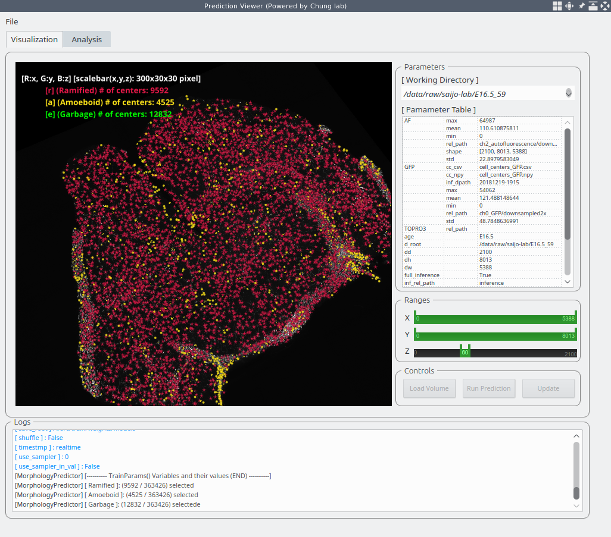

## MorPheT
An end-to-end framework for cell morphology phenotyping


## Installation
The anaconda environment for MorPheT can be installed using environment.yml.
```
conda env create -f environment.yml
```

Install required packages:
```
make setup.env.x
```

Other required packages (defined under .gitmodules):
```
git clone --recurse-submodules -j8 git@github.com:chunglabmit/morphet.git
```


### 

---

### GUI Tools (QT-based)
#### Launch MorPheT GUI
```shell
# entrypoint: ./src/gui/MorPheT/main.py
# to launch,
$ make launch.morphet.x
```


#### Stand-alone Data Annotator GUI
```shell
# entrypoint: ./src/gui/main.py
# to launch,
$ make launch.annotator.x set=[train/val/test]
# SET: 'train', 'val', etc
```


#### Model Evaluator GUI
```shell
# entrypoint: ./src/gui/evaluator/main.py
# to launch,
$ make launch.evaluator.x
```


#### Prediction Visualizer GUI
```shell
# entrypoint: ./src/gui/prediction/main.py
# to launch,
$ make launch.predictor.x
```

